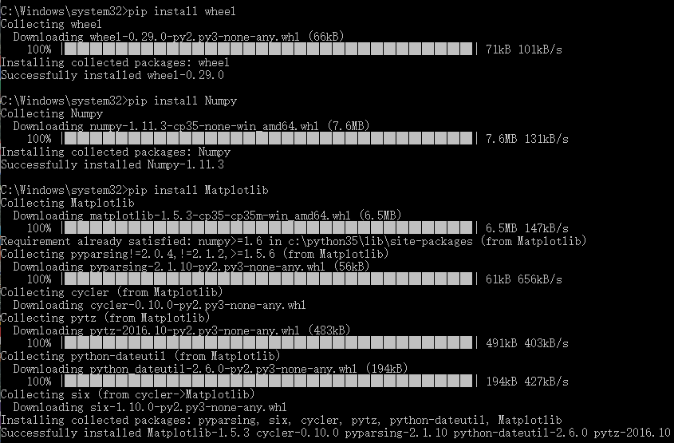

## 一些在python使用过程中的基础知识
#### git问题
- git clone git@github.com:zhudingsuifeng/python.git  #克隆远程代码库到本地
- $git branch -a 查看所有分支(包括远程分支)
- master   #本地分支
- remotes/origin/master #远程分支
- git branch -d master   #删除本地分支，远程还是会显示分支
- git push origin --delete master  #删除远程分支，刷新网页，远程分支不见了
- git checkout master    #切换分支
- git merge branch1     #合并branch1到当前分支
### python
- centos7下安装python-pip
```javascript 
#yum install -y python-pip    #报错
No package python-pip available.
#yum -y install epel-release   #安装epel扩展源
#yum -y install python-pip     #这就可以使用pip安装python的程序包了
#pip install SomePackage #Install a package from PyPI
pip show --files SomePackage #show what files were installed
pip list --outdated    #list what package are outdated
pip install --upgrade SomePackage #upgrade a package
pip uninstall SomePackage   #uninstall a package
pip search SomePackage    #search PyPI for packages
pip list    #to list installed packages
python2 -m pip list #列出在python2环境下安装的包
python2 -m pip uninstall numpy #删除python2环境下的numpy包
python2 -m pip install numpy==1.13.1    #在python2环境下安装指定版本的包
python2 -m pip install pandas #重新安装对numpy有依赖的pandas包
```
- pip list显示的结果是已经安装的软件包的版本，并不一定是真正实用的软件包的版本。
## 下面介绍一个遇到的实际问题：
- import skimage.measure as sm   #skimage是一个图像处理的包，在执行程序的时候报错
- ValueError: numpy.dtype has the wrong size, try recompiling.Expected 88, got 96.
- 执行的这段程序是我之前在虚拟机上执行过的，没有报过错。
- pip list #在虚拟机里显示numpy(1.13.1),在电脑上同样是numpy(1.13.1)
- 在python中也有个查看引用的包所使用的版本的方法。
- import numpy
- numpy.version.version #虚拟机里显示'1.13.1',电脑里显示'1.9.0',这就显示出不同了。
- numpy.__file__   #这个命令可以查看对应的文件位置。
- 其实都是电脑里面同时存在python2和python3惹的祸，两个不同版本的numpy分别安装在不同版本的python中。
```javascript
$python2
>>>import numpy
>>>numpy.version.version
'1.9.0'
>>>numpy.__file__
'/usr/lib64/python2.7/site-packages/numpy/__init__.pyc'
>>>import matplotlib
>>>matplotlib.__version__
'2.0.2'
$python3
>>>import numpy
>>>numpy.version.version
'1.13.1'
>>>numpy.__file__
'/usr/lib64/python3.4/site-packages/numpy/__init__.py'
python2 -m pip uninstall numpy #卸载原有版本
python2 -m pip install numpy==1.13.1 #安装numpy1.13.1
python2 -m pip install pandas #重新安装对numpy有依赖的pandas包
import skimage.measure as sm   #运行成功
``` 
- 打开文件的两种方式略有不同：
```javascript
with open("../data/changefile.csv") as csvf:
	reader=csv.reader(csvf)
	print(type(reader))   #<type 'list'>
	print(len(reader))    #TypeError:object of type '_csv.reader' has no len() 
	for row in reader:
		print(row)       #['300312','-2.62',...]
		print(type(row)) #<type 'list'>
		print(type(row[0]))  #<type 'str'>
csvf=open("../data/changefile.csv").readlines()
print(type(csvf))       #<type 'list'>
print(len(csvf))        #2918
for row in range(0,len(csvf)):
    print(csvf[row])  #300312,-2.62,0.35...
    print(type(csvf[row])) #<type 'str'>
```
### python一些函数的说明
```javascript
import numpy as np 
np.array(np.zeros([10,10]),dtype=np.float32) 
#np.array()create an array,np.zeros([m,n])create m*n matrices,dtype=np.float32,specifies the data type.
e,v=np.linalg.eig(x) #Compute the eigenvalues and right eigenvectors of a square array.
#return e,v ,e is the eigenvalues,v is the normalized eigenvectors,such that the column v[:,i] is the eigenvector corresponding to the eigenvalue e[i].
np.argsort(a,axis=-1,kind='quicksort',order=None) #Returns the indices that would sort an array.
#Perform an indirect sort along the given axis using the algorithm specified by the kind keyword.It returns an array of indiecs of the same shape as a that index data along the given axis in sorted order.
```
###使用sublimetext搭建Python开发环境
- 前面准备，首先要安装Python和Github和sublimetext
- 在安装sublimentext后，使用ctrl+shift+P打开控制面板，安装install Package
- 安装sublimecodeintel,sublimeREPL
- 安装GitGutter插件，然后在sublime的preferences-Package Settings下的GitGutter-Settings User添加 
{
"git_binary": "git.exe目录，注意\转义字符，最后要到git.exe"
}
- 安装Anaconda（号称最强的Python IDE插件），这个插件和前面的不是很好的搭配，但是既然安装了就要彻底解决麻烦，可以参考http://www.cnblogs.com/nx520zj/p/5787393.html
###windows下使用cmd安装numpy和matplotlib出现常见问题：
- permission error:在cmd下执行需要管理员的命令时，没有管理员权限。
- 在C:\Windows\System32下找到cmd.exe文件，右键，以管理员身份运行。
- python3.5.2版本里有pip，因此只需要更新一下就可以了：Python -m pip install -U pip ,显示Requirement already up-to-date:就是说要求已经更新
- 还需要安装wheel: pip install wheel
- 安装Numpy: pip install Numpy
- 安装Matplotlib: pip install Matplotlib
  
- pip是目前python包管理的事实标准。它作为easy_install的替代品，但是它仍有大量的功能建立在setuptools组件之上。
- pip可以直接从gz或者zip压缩包安装，支持搜索包，以及制定服务器安装等功能。
- wheel本质上是一个zip包格式，它使用.whl扩展名，用于Python模块的安装，他的出现是为了替代eggs.
- pip提供了一个wheel子命令来安装wheel包。但是，需要先安装wheel模块。
